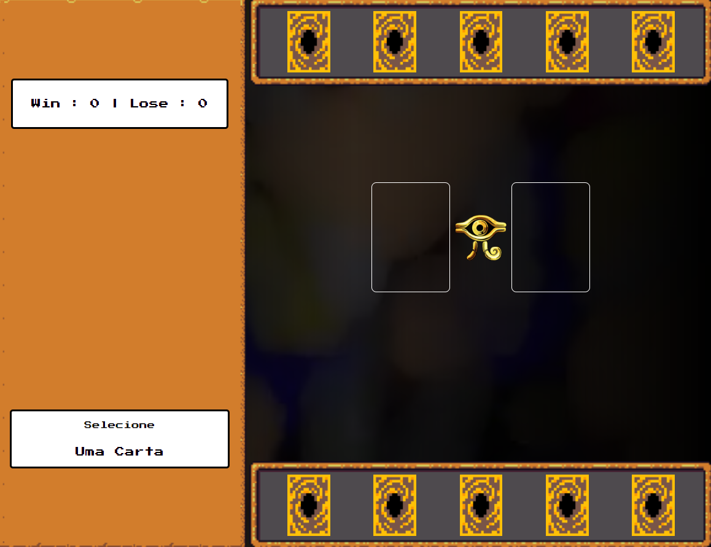
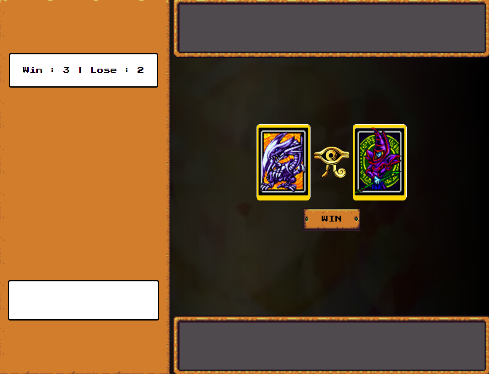

# Yu-Gi-Oh | Jo-ken-po Edition

Jogo de jokenpo que criei para explicar conceitos de lógica de programação aplicados a jogos

conceitos abordados:

- Armazenamento e gerenciamento de estado manual
- Funções limpas
- Organização de código
- Usando a biblioteca RPGUI	
- Aprendendo a Técnica de Extract to Method

